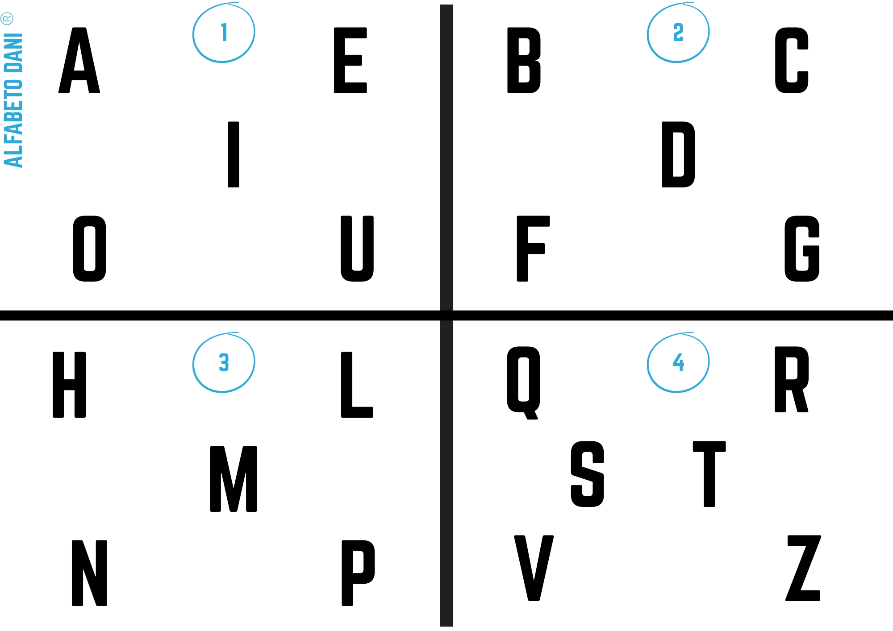

# 🌍 DANIELA ALPHABET – Human Blink Communication System

## 🇬🇧 English Version

### 🌍 Mission

The Daniela Alphabet is a human communication system developed in 2006 from the real-life experience of Daniela Gazzano, a person living with Locked-in Syndrome.

It allows communication through minimal signals such as eye blinks, restoring:
- dignity
- connection
- expression
- human presence

This system is offered freely to all humanity.

---

### 🧠 How it works

The system is based on:

1. Dividing the alphabet into groups (quadrants)
2. Each group is identified by a number
3. The user selects:
   - first the group (e.g. 1–4)
   - then the letter inside the group
4. The selection is made through:
   - eye blinks
   - eye movements
   - any minimal voluntary signal

This allows full construction of:
- letters
- words
- complete sentences

---

### ❤️ Origin

This method was developed within the family of Daniela Gazzano to enable communication in a condition of total paralysis, where the only possible movement was the eyelids.

Over time, it enabled:
- daily communication
- emotional relationships
- writing and storytelling

---

### 📜 License

This project is released under:

**Daniela Humanity License (DHL) v1.0**

See LICENSE.md

---

### ⚖️ Core Principles

This system is:

✔ free  
✔ universal  
✔ accessible  

But:

❌ cannot be used for profit  
❌ cannot be patented by third parties  
❌ cannot be privatized  

---

## Historical Documentation and Public Evidence

The Daniela Alphabet communication system is publicly documented through multiple independent and verifiable sources developed over many years.

### Historical Origin

- Daniela Gazzano began using the Daniela Alphabet communication method on March 1st, 2006, after developing a severe Locked-in Syndrome condition.
- The system was progressively developed and used for real-world daily communication with family members, caregivers, and healthcare professionals.

### Published Book

- Daniela Gazzano authored the book *Le storie magiche della radura incantata*, published by Salani Editore in 2018.
- The book was entirely written using the Daniela Alphabet method through eye-based communication, requiring more than 116,000 eye blinks.

### Public Documentation

- Public television appearances, interviews, demonstrations, and nonprofit association videos are publicly available through the official YouTube channel:
  https://www.youtube.com/@gliamicididaniela

### Official Websites

- Official project website:
  https://danielaalphabet.org

- Official association website:
  https://www.amicididaniela.it/i-nostri-progetti/metodo-di-comunicazione-di-daniela/

### Public Dissemination

- The system has been publicly presented through TV, conferences, nonprofit initiatives, social media communication, advocacy activities, and public events related to disability, communication accessibility, and inclusion.

### Humanitarian Purpose

These materials demonstrate prior public existence, continuous real-world use, historical origin, and non-commercial humanitarian intent associated with the Daniela Alphabet communication system.

This system is shared freely for humanitarian and accessibility purposes and is intended to remain permanently accessible to humanity.

### 🌱 Message

"An eye blink can say everything."

---

## 🇮🇹 Versione Italiana

### 🌍 Missione

L'Alfabeto Daniela è un sistema di comunicazione sviluppato nel 2006 a partire dall’esperienza reale di Daniela Gazzano, persona affetta da Locked-in Syndrome.

Permette di comunicare attraverso segnali minimi come il battito delle palpebre, restituendo:
- dignità
- relazione
- espressione
- presenza umana

Questo sistema è reso disponibile gratuitamente a tutta l’umanità.

---

### 🧠 Come funziona

Il sistema si basa su:

1. Suddivisione dell’alfabeto in gruppi (quadranti)
2. Ogni gruppo è associato a un numero
3. Il comunicatore indica:
   - prima il gruppo (es. 1–4)
   - poi la lettera all’interno del gruppo
4. Il segnale viene dato tramite:
   - battito di ciglia
   - movimento oculare
   - qualsiasi segnale minimo disponibile

Questo consente di costruire:
- lettere
- parole
- frasi complete

---

### ❤️ Origine

Questo metodo è stato sviluppato all’interno della famiglia di Daniela Gazzano per permettere la comunicazione in una condizione di paralisi totale, dove l’unico movimento possibile è quello delle palpebre.

Nel tempo ha permesso:
- comunicazione quotidiana
- relazione affettiva
- espressione completa

---

### 📜 Licenza

Questo progetto è distribuito sotto:

**Daniela Humanity License (DHL) v1.0**

Vedi file LICENSE.md

---

### ⚖️ Principi fondamentali

Questo sistema è:

✔ libero  
✔ universale  
✔ accessibile  

Ma:

❌ NON può essere usato per profitto  
❌ NON può essere brevettato da terzi  
❌ NON può essere privatizzato  

---

## Documentazione Storica e Prove Pubbliche

Il sistema di comunicazione Daniela Alphabet è documentato pubblicamente attraverso molteplici fonti indipendenti e verificabili sviluppate nel corso di molti anni.

### Origine Storica

- Daniela Gazzano ha iniziato a utilizzare il metodo di comunicazione Daniela Alphabet il 1° marzo 2006, dopo aver sviluppato una grave condizione di Locked-in Syndrome.
- Il sistema è stato progressivamente sviluppato e utilizzato nella comunicazione quotidiana reale con familiari, caregiver e professionisti sanitari.

### Libro Pubblicato

- Daniela Gazzano è autrice del libro *Le storie magiche della radura incantata*, pubblicato da Salani Editore nel 2018.
- Il libro è stato interamente scritto utilizzando il metodo Daniela Alphabet attraverso comunicazione basata sul movimento degli occhi, richiedendo oltre 116.000 battiti di ciglia.

### Documentazione Pubblica

- Apparizioni televisive pubbliche, interviste, dimostrazioni e video dell’associazione no profit sono disponibili pubblicamente attraverso il canale YouTube ufficiale:
  https://www.youtube.com/@gliamicididaniela

### Siti Ufficiali

- Sito ufficiale del progetto:
  https://danielaalphabet.org

- Sito ufficiale dell’associazione:
  https://www.amicididaniela.it/i-nostri-progetti/metodo-di-comunicazione-di-daniela/

### Diffusione Pubblica

- Il sistema è stato presentato pubblicamente attraverso la TV, conferenze, iniziative no profit, comunicazione social, attività di sensibilizzazione ed eventi pubblici legati alla disabilità, all’accessibilità della comunicazione e all’inclusione.

### Finalità Umanitaria

Questi materiali dimostrano l’esistenza pubblica precedente, l’utilizzo reale continuativo, l’origine storica e l’intento umanitario non commerciale associato al sistema di comunicazione Daniela Alphabet.

Questo sistema viene condiviso liberamente per finalità umanitarie e di accessibilità ed è destinato a rimanere permanentemente accessibile all’umanità.

### 🌱 Messaggio

"Un battito di ciglia può dire tutto."
